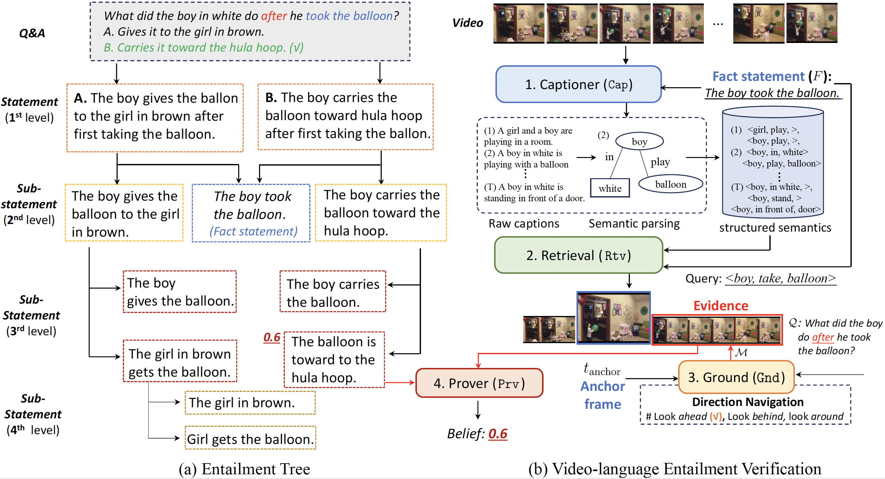
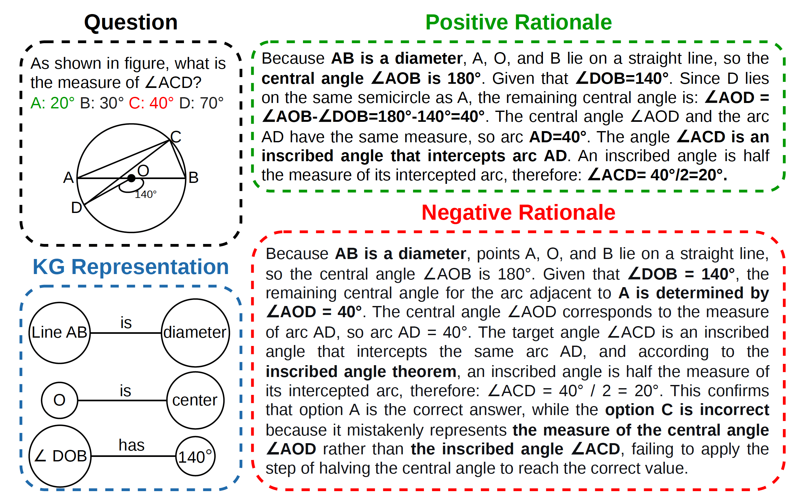
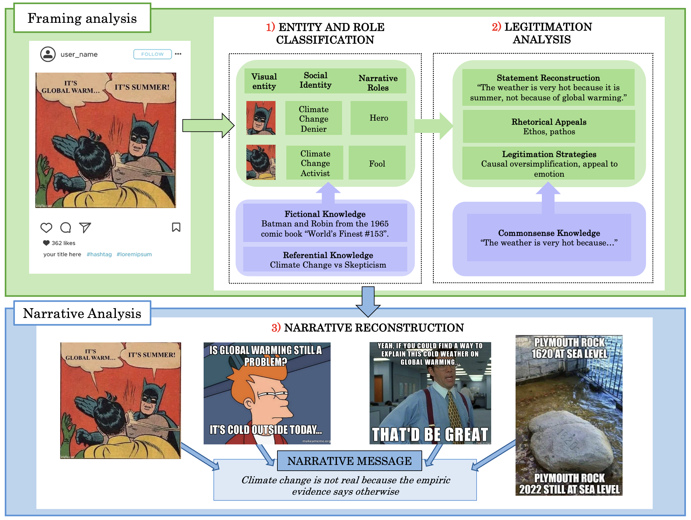

We investigate how to transform the development of **human-centric AI with common sense** to ultimately contribute to a more humane world. We conduct fundamental research on **commonsense AI** and investigate its application to online content safety, informed by **empirical insights and interdisciplinary theories** from cognitive psychology, communication science, and linguistics, always looking to broaden our perspective. Our approach seeks to align theory, background knowledge, explainable decision-making, and theory-grounded benchmarking.

The commonsense AI team pursues the following thrusts:

<table style="border-collapse: collapse; border: none; table-layout: fixed ; width: 100%;">
<tr style="border: none;">
  <td style="text-align: center; border: none">
      
  </td>
  <td style="border: none">
      <b>Commonsense reasoning:</b> Commonsense reasoning remains a tough nut to crack for state-of-the-art AI. We explore various kinds of commonsense reasoning: abduction, analogy, defeasibility, dialogical reasoning, and informal argumentation/rhetorics. We develop benchmarks and perform studies to understand the ability of state-of-the-art AI to perform commonsense reasoning. We explore neuro-symbolic methods such as entailment trees and combining LLMs with cognitive models, logical engines, and knowledge graphs.  
  </td>
</tr>
<tr style="border: none;">
  <td style="text-align: center; border: none">
      
  </td>
  <td style="border: none">
  <b>Modeling the physical world:</b> Drawing on a long tradition of work from naïve physics to Gibson’s affordances to today’s “hot” world models, we explore how to model the physical world. We investigate how to align multiple modalities, reason about affordances, and develop anticipatory world models. For this purpose, we combine commonsense knowledge sources and scene knowledge graphs with foundation models and reinforcement learning.
  </td>
</tr>
<tr style="border: none;">
  <td style="text-align: center; border: none">
      
  </td>
  <td style="border: none">
  <b>Socio-cultural-moral sense-making: </b> While commonsense AI aims to provide a common ground for human-AI collaboration based on explicit knowledge modeling, it is important to recognize that such a common ground is inevitably conditioned on particular social, cultural, and moral viewpoints. With this in mind, we study critical thinking and bias in AI systems, and we explore mechanisms to incorporate socio-cultural perspectives and values for a responsible AI. We incorporate naive psychology models about beliefs, desires, intentions, and emotions. We look at complex, perspectivized, and safety-sensitive media such as internet memes from the lens of evolving multimodal narratives.
  </td>
</tr>
</table>

Finally, we explore **cross-cutting topics** that matter for commonsense reasoning in the physical and socio-cultural-moral AI. These topics are critical for multiple of the above pillars. They include abstraction and framing, causality, explainability, embodiment, and construct validity.

See [my recent publications](https://www.ilievski.info/publications/) for more information.
