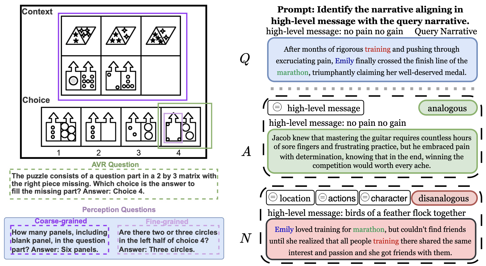

We investigate how to transform the development of **human-centric AI with common sense** to ultimately support **social good** applications.

We conduct fundamental research on commonsense AI and investigate its application to online content safety, informed by **empirical insights and interdisciplinary theories**. We mostly draw on theories from cognitive science, communication science, and linguistics, always looking to broaden our perspective. Our approach integrates four key pillars: theory, background knowledge, explainable decision-making, and theory-grounded benchmarking.

<table style="border-collapse: collapse; border: none; table-layout: fixed ; width: 100%;">
<tr style="border: none;">
  <td style="text-align: center; border: none">
      
  </td>
  <td style="border: none">
      <b>Commonsense reasoning:</b> Both commonsense psychology and naive physics are important topics for our lab. We perform fundamental research on situational awareness, narrative understanding, and video reasoning. We focus on building generalizable methods that provide a faithful rationale for their reasoning. We explore neuro-symbolic methods such as entailment trees, combining LLMs with deterministic engines, and reasoning with scene knowledge graphs. 
  </td>
</tr>
<tr style="border: none;">
  <td style="text-align: center; border: none">
      
  </td>
  <td style="border: none">
  <b>Multimodal analogy and abstraction:</b> We study analogy and abstraction in AI inspired by key cognitive generalization mechanisms of humans. We focus on narratives and lateral thinking puzzles, covering text and vision. We create benchmarks and develop neuro-symbolic methods to advance the state-of-the-art in abstraction and analogical reasoning. We develop methods that derive and leverage explicit representations to enable robust and interpretable learning from experience.
  </td>
</tr>
<tr style="border: none;">
  <td style="text-align: center; border: none">
      
  </td>
  <td style="border: none">
  <b>AI for social good:</b> We investigate how AI can serve individuals and society. We study and develop methods to interpret arguments and narratives in complex online media, such as internet memes and tweets, which depend on personal and cultural values and background knowledge. Our methods strive to capture and explain misinformation and hate speech with a keen eye on their dependency on personal and cultural views. We also work on understanding how knowledge-based AI solutions can support sustainable policies, neuro-symbolic models for traffic monitoring, and multimodal reasoning in robotics.
  </td>
</tr>
</table>

See [my recent publications](https://www.ilievski.info/publications/) for more information.
