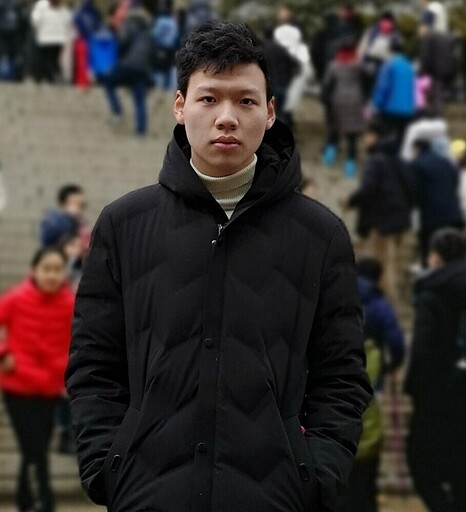

<h2>PhD Students</h2>

<table width="600px" style="border-collapse: collapse; border: none;">
<tr style="border: none;">
<td style="text-align: center; border: none">

</td>
<td style="text-align: center; border: none">

</td>
  <td style="text-align: center; border: none">
    
    

  </td>
</tr>
<tr style="border: none;">
  <td style="text-align: center; border: none">  
    
<b>Peifeng Wang</b>, 2020- 
    Commonsense reasoning with knowledge graphs and language models

  </td>
  <td style="text-align: center; border: none">
    
<b>Zhivar Sourati</b>, 2022- 
  Robust and explainable commonsense reasoning with analogies

  </td>
  <td style="text-align: center; border: none">
    
<b>Jiarui Zhang</b>, 2022- 
      Knowledge-enhanced intelligent traffic monitoring

  </td>
  </tr>
</table>

<h1>Master Students</h1>

**Harshit Manektalia**, MS, 2022-\
Dimensional similarity of concepts

**Vishnu Priya Prasanna Venkatesh**, MS, 2022-\
Logical fallacy identification

**Yifan Jiang**, MS, 2022-\
Procedural reasoning

**Aravinda Kolla**, MS, 2022-\
Situational awareness in traffic

**Thiloshon Nagarajah**, MS, 2022-\
Analogical reasoning in narratives

**Abhinav Kumar Thakur**, MS, 2022-\
Knowledge Graph Fact Verification

<h1>Undergraduate Students</h1>

**Lucas Zhuang**, 2022-\
Recency of Knowledge Graphs

## Past

**Shubham Akhilesh Singh**, MS, 2022\
Knowledge graph question answering

**Jiasheng Gu**, MS, 2022\
Link prediction with critic language models

**Dweepa Honnavali**, MS, 2022\
Commonsense story generation

**Vaibhav Vats**, MS, 2022\
Entity linking in Wikidata

**Sukavanan Nanjundan**, MS, 2022\
Dimensional similarity of concepts

**Jiang Wang**, MS, 2021-2022\
Link prediction with augmented knowledge graphs

**Jiarui Zhang**, BS, 2021-2022\
Zero-shot commonsense reasoning with knowledge graphs

**Bohui Zhang**, MS, 2021-2022\
Enriching Wikidata with linked open data

**Nicholas Klein**, MS (USC/ISI Rising star program), 2020-2022\
Profiling Wikidata entities and identification of surprising facts

**Sara Melotte, Aditya Malte, Linglan Zhang, Namita Mutha**, MS (CKIDS program), 2021\
Biases in commonsense knowledge sources

**Zaina Shaik**, BS (NSF REU program), 2021\
Biases in factual knowledge graphs

**Pushkaraj Jitendra Sarnobat**, MS, 2021\
Scene graph generation

**Kartik Shenoy**, MS, 2021-2022\
Wikidata quality and concept similarity

**Ehsan Qasemi**, PhD, 2020-2021\
Preconditions of commonsense knowledge

**Avijit Thawani**, PhD, 2020-2021\
Language model numeracy

**Bin Zhang**, MS, 2020-2021\
Organizing commonsense knowledge, and integration with language models

**Hanzhi Zhang**, MS, 2020-2021\
Commonsense story generation and explanation
