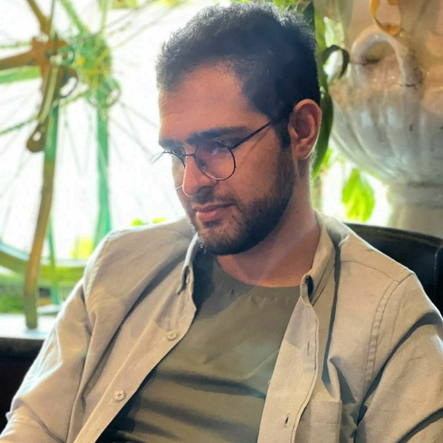
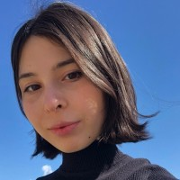
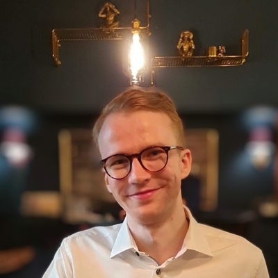
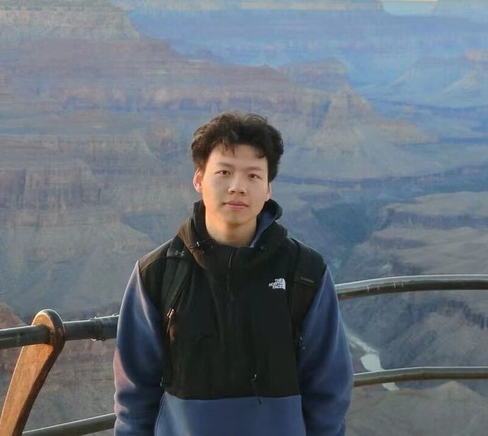
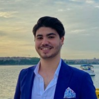

## PhD Students

<table style="border-collapse: collapse; border: none; table-layout: fixed ; width: 100%;">
<tr style="border: none;">
<td style="text-align: center; border: none">
    
</td>
  <td style="text-align: center; border: none">
        
  </td>
<td style="text-align: center; border: none">

</td>
</tr>
<tr style="border: none;">
  <td style="text-align: center; border: none">
    
<b>Mohammad Hossein Khojasteh</b> 2024- 
    Analogical Abstraction

  </td>
  <td style="text-align: center; border: none">
    
<b>Gabriella Bollici</b>, 2024- 
    Value-aware Reasoning about Memes

  </td>
  <td style="text-align: center; border: none">  
    
<b>Fabian Hoppe</b>, VU Amsterdam, 2023- 
    Robust Autoformalization with LLMs

  </td>
</tr>
</table>

## External PhD Students

<table style="border-collapse: collapse; border: none; table-layout: fixed ; width: 100%;">
<tr style="border: none;">
  <td style="text-align: center; border: none">
        
  </td>
  <td style="text-align: center; border: none">
        
  </td>
  <td style="text-align: center; border: none">
    
</td>
</tr>
<tr style="border: none;">
  <td style="text-align: center; border: none">
    
<b>Bradley P. Allen</b>, University of Amsterdam, 2024- 
    NeSy Knowledge Engineering

  </td>
  <td style="text-align: center; border: none">
    
<b>Zhivar Sourati</b>, USC/ISI, 2022- 
  Cognitively-inspired Abstraction in AI

  </td>
  <td style="text-align: center; border: none">
    
<b>Jiarui Zhang</b>, USC/ISI, 2022- 
      Multimodal Complex Reasoning

  </td>
  </tr>
</table>

## Research Assistants

<table style="border-collapse: collapse; border: none; table-layout: fixed ; width: 100%;">
  <tr style="border: none;">
<td style="text-align: center; border: none">

</td>

</tr>
<tr style="border: none;">
  <td style="text-align: center; border: none">  
    
<b>Kaan Aslan</b>, VU Amsterdam, 2024- 
    Knowledge-driven AI for Sustainability

  </td>
  </tr>
</table>

## Past

**Koen Kraaijveld**, RA, 2024 \
Visual lateral thinking

**Mehdi Jafari**, RA, 2024 \
LLM-Modulo reasoning

**Mohammad Hossein Khojasteh**, RA, 2024 \
Rule induction for educational recommendations

**Ruthu H. Rooparaghunath**, RA, 2024 \
Analogical reasoning

**Darshan Girish Deshpande**, RA, 2022-2024 \
Active learning with LLMs

**Peifeng Wang**, PhD, 2020-2023 \
Commonsense reasoning with knowledge graphs and language models

**Prateek Chhikara**, RA, 2022-2023 \
Text-based games with commonsense reasoning

**Yifan Jiang**, RA, 2022-2023 \
Procedural reasoning

**Vishnu Priya Prasanna Venkatesh**, RA, 2022-2023 \
Logical fallacy identification

**Himanshu Rawlani**, RA, 2022 \
Propaganda detection

**Thiloshon Nagarajah**, RA, 2022 \
Understanding affordances in procedures

**Aravinda Kolla**, RA, 2022 \
Slang representation learning

**Abhinav Kumar Thakur**, RA, 2022 \
Meme understanding

**Ana Iglesias**, PhD intern, 2022 \
Modeling Temporal Knowledge Graphs

**Lucas Zhuang**, BS intern, 2022-\
Knowledge Graph Fact Verification

**Harshit Manektalia**, RA, 2022\
Dimensional similarity of concepts

**Shubham Akhilesh Singh**, RA, 2022\
Knowledge graph question answering

**Jiasheng Gu**, RA, 2022\
Link prediction with critic language models

**Dweepa Honnavali**, RA, 2022\
Commonsense story generation

**Vaibhav Vats**, RA, 2022\
Entity linking in Wikidata

**Sukavanan Nanjundan**, RA, 2022\
Dimensional similarity of concepts

**Jiang Wang**, RA, 2021-2022\
Link prediction with augmented knowledge graphs

**Jiarui Zhang**, BS, 2021-2022\
Zero-shot commonsense reasoning with knowledge graphs

**Bohui Zhang**, RA, 2021-2022\
Enriching Wikidata with linked open data

**Nicholas Klein**, MS (USC/ISI Rising star program), 2020-2022\
Profiling Wikidata entities and identification of surprising facts

**Sara Melotte, Aditya Malte, Linglan Zhang, Namita Mutha**, MS (CKIDS program), 2021\
Biases in commonsense knowledge sources

**Zaina Shaik**, BS (NSF REU program), 2021\
Biases in factual knowledge graphs

**Pushkaraj Jitendra Sarnobat**, RA, 2021\
Scene graph generation

**Kartik Shenoy**, RA, 2021-2022\
Wikidata quality and concept similarity

**Ehsan Qasemi**, PhD, 2020-2021\
Preconditions of commonsense knowledge

**Avijit Thawani**, PhD, 2020-2021\
Language model numeracy

**Bin Zhang**, RA, 2020-2021\
Organizing commonsense knowledge, and integration with language models

**Hanzhi Zhang**, RA, 2020-2021\
Commonsense story generation and explanation
