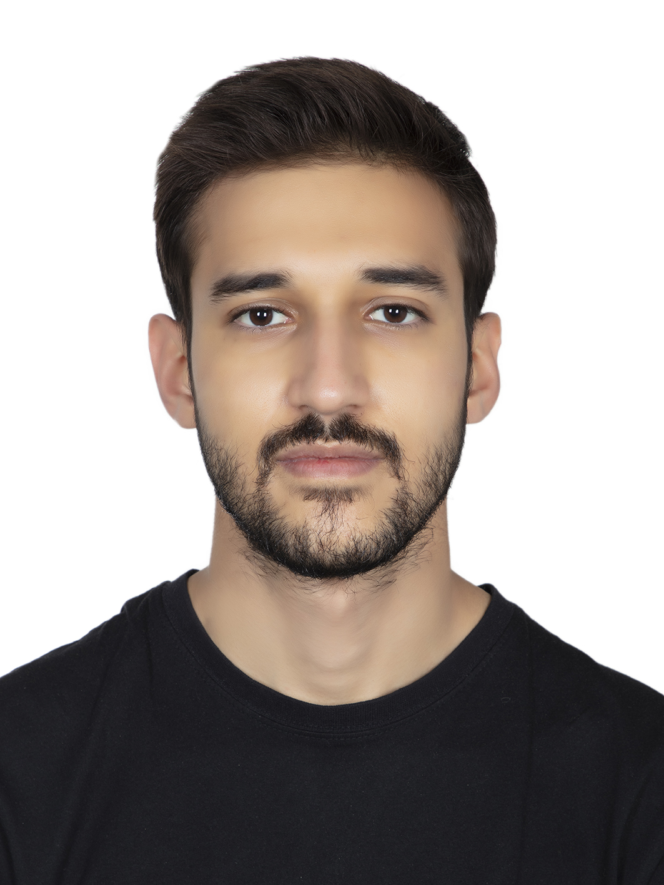

## What We Do

We investigate **human-centric AI systems with common sense** that can team with people in intuitive and reliable ways.

We perform fundamental research on commonsense AI and investigate its application to challenging domains, informed by **empirical insights and cognitive theories**.

## Research Topics

* **Commonsense Reasoning**(e.g., modeling story procedures, tracking participant states, and performing counterfactual inference; decision-making in everyday situations)
* **Human-centric NLP**(e.g., drawing situational analogies according to cognitive theories; lateral thinking in AI; studying and building robust and explainable models)
* **AI for Social Good**(e.g., value-aware detection of fallacies in arguments and hate speech in memes; what-if reasoning in traffic)

## PhD Students

<table style="border-collapse: collapse; border: none; table-layout: fixed ; width: 100%;">
<tr style="border: none;">
<td style="text-align: center; border: none">

</td>
  <td style="text-align: center; border: none">
        
  </td>
  <td style="text-align: center; border: none">
    
</td>
</tr>
<tr style="border: none;">
  <td style="text-align: center; border: none">  
    
<b>Fabian Hoppe</b>, VU Amsterdam, 2023- 
    Neuro-symbolic verification models

  </td>
  <td style="text-align: center; border: none">
    
<b>Zhivar Sourati</b>, USC/ISI, 2022- 
  Cognitively-inspired abstraction in AI

  </td>
  <td style="text-align: center; border: none">
    
<b>Jiarui Zhang</b>, USC/ISI, 2022- 
      Multimodal complex reasoning

  </td>
  </tr>
</table>

## Research Assistants

<table style="border-collapse: collapse; border: none; table-layout: fixed ; width: 100%;">
  <tr style="border: none;">
<td style="text-align: center; border: none">

</td>
  <td style="text-align: center; border: none">
      
  </td>
  <td style="text-align: center; border: none">
      
  </td>
</tr>
<tr style="border: none;">
  <td style="text-align: center; border: none">  
    
<b>Mohammad Hossein Khojasteh</b>, VU Amsterdam, 2024- 
    Rule induction for educational recommendations

  </td>
  <td style="text-align: center; border: none">
    
<b>Mehdi Jafari</b>, VU Amsterdam, 2024- 
    Neuro-symbolic verification models

  </td>
  <td style="text-align: center; border: none">
    
<b>Ruthu H. Rooparaghunath</b>, VU Amsterdam, 2024- 
    Analogical reasoning

  </td>
  </tr>
</table>

## Past

**Darshan Girish Deshpande**, MS, 2022-2024 \
Active learning with LLMs

**Peifeng Wang**, PhD, 2020-2023 \
Commonsense reasoning with knowledge graphs and language models

**Prateek Chhikara**, MS, 2022-2023 \
Text-based games with commonsense reasoning

**Yifan Jiang**, MS, 2022-2023 \
Procedural reasoning

**Vishnu Priya Prasanna Venkatesh**, MS, 2022-2023 \
Logical fallacy identification

**Himanshu Rawlani**, MS, 2022 \
Propaganda detection

**Thiloshon Nagarajah**, MS, 2022 \
Understanding affordances in procedures

**Aravinda Kolla**, MS, 2022 \
Slang representation learning

**Abhinav Kumar Thakur**, MS, 2022 \
Meme understanding

**Ana Iglesias**, PhD intern, 2022 \
Modeling Temporal Knowledge Graphs

**Lucas Zhuang**, BS intern, 2022-\
Knowledge Graph Fact Verification

**Harshit Manektalia**, MS, 2022\
Dimensional similarity of concepts

**Shubham Akhilesh Singh**, MS, 2022\
Knowledge graph question answering

**Jiasheng Gu**, MS, 2022\
Link prediction with critic language models

**Dweepa Honnavali**, MS, 2022\
Commonsense story generation

**Vaibhav Vats**, MS, 2022\
Entity linking in Wikidata

**Sukavanan Nanjundan**, MS, 2022\
Dimensional similarity of concepts

**Jiang Wang**, MS, 2021-2022\
Link prediction with augmented knowledge graphs

**Jiarui Zhang**, BS, 2021-2022\
Zero-shot commonsense reasoning with knowledge graphs

**Bohui Zhang**, MS, 2021-2022\
Enriching Wikidata with linked open data

**Nicholas Klein**, MS (USC/ISI Rising star program), 2020-2022\
Profiling Wikidata entities and identification of surprising facts

**Sara Melotte, Aditya Malte, Linglan Zhang, Namita Mutha**, MS (CKIDS program), 2021\
Biases in commonsense knowledge sources

**Zaina Shaik**, BS (NSF REU program), 2021\
Biases in factual knowledge graphs

**Pushkaraj Jitendra Sarnobat**, MS, 2021\
Scene graph generation

**Kartik Shenoy**, MS, 2021-2022\
Wikidata quality and concept similarity

**Ehsan Qasemi**, PhD, 2020-2021\
Preconditions of commonsense knowledge

**Avijit Thawani**, PhD, 2020-2021\
Language model numeracy

**Bin Zhang**, MS, 2020-2021\
Organizing commonsense knowledge, and integration with language models

**Hanzhi Zhang**, MS, 2020-2021\
Commonsense story generation and explanation
